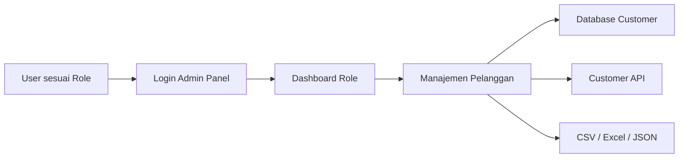
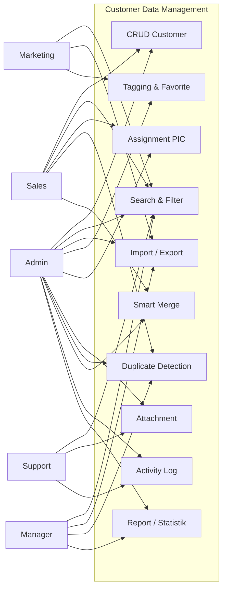
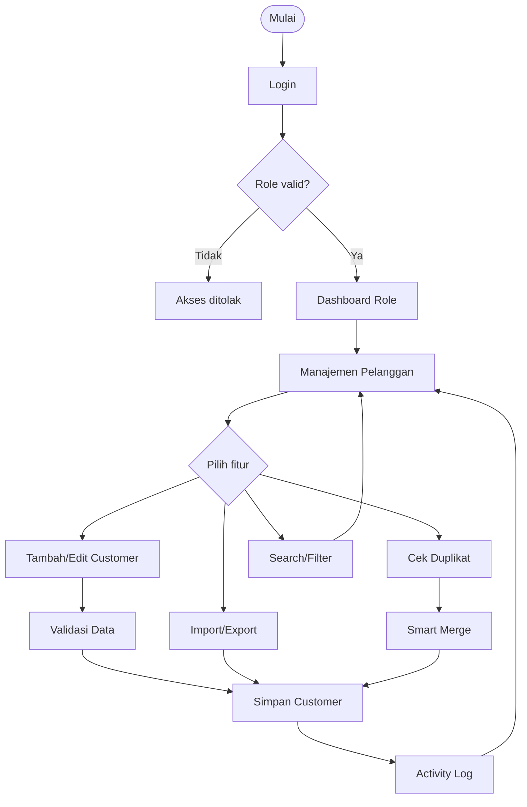
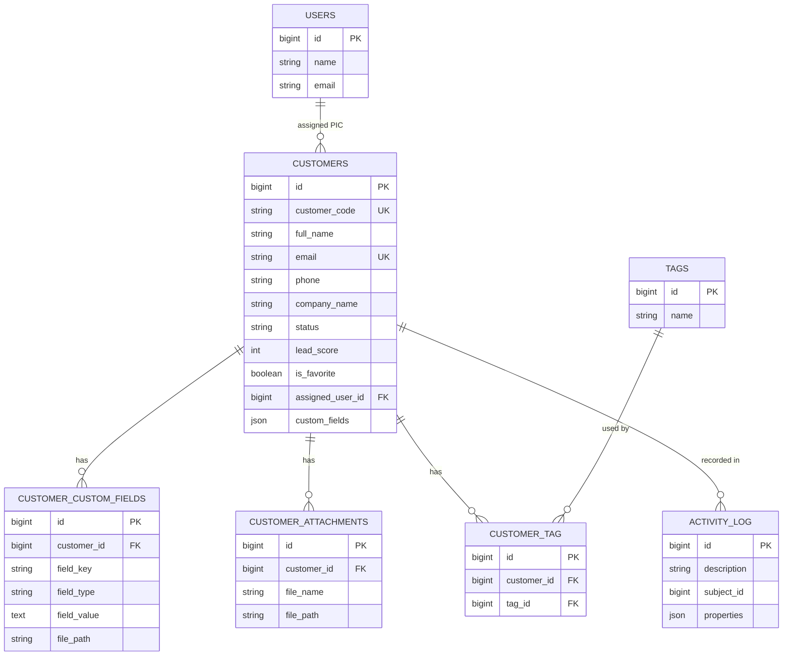

# Perancangan dan Implementasi Fitur Customer Data Management pada Sistem SmartCRM79 Berbasis Web

## Design and Implementation of Customer Data Management Features in the Web-Based SmartCRM79 System

Dokumen ini ditujukan untuk memenuhi persyaratan mata kuliah proyek terapan.

Disusun oleh:

- Maikel Buala Beriman Hulu
- M Indrawan
- Muhammad Rafiq Nur Ghifari

Program Studi D3 Rekayasa Perangkat Lunak Aplikasi  
Fakultas Ilmu Terapan  
Universitas Telkom  
Bandung  
2026

---

# KATA PENGANTAR

Puji syukur penulis panjatkan kepada Tuhan Yang Maha Esa karena atas rahmat dan karunia-Nya
laporan pengerjaan modul **Customer Data Management** pada sistem SmartCRM79 ini dapat
diselesaikan. Laporan ini disusun untuk menjelaskan proses pengerjaan project mulai dari
perancangan database, pengembangan model, pembuatan fitur backend, implementasi dashboard
admin, pengaturan role, hingga pengujian fitur.

Modul Customer Data Management dikembangkan sebagai pusat data pelanggan pada SmartCRM79.
Modul ini berfungsi untuk menyimpan, mengelola, mencari, mengelompokkan, mengimpor,
mengekspor, mendeteksi duplikasi, menggabungkan data duplikat, menyimpan lampiran, dan
mencatat riwayat aktivitas pelanggan. Dengan adanya modul ini, data pelanggan dapat digunakan
secara konsisten oleh role Admin, Sales, Marketing, Support, dan Manager/Analyst.

Penulis menyadari bahwa laporan ini masih dapat dikembangkan lebih lanjut. Oleh karena itu,
kritik dan saran yang membangun sangat diharapkan agar project SmartCRM79 dapat menjadi lebih
baik.

Bandung, Juni 2026  
Penulis

---

# ABSTRAK

SmartCRM79 merupakan sistem Customer Relationship Management berbasis web yang dirancang
untuk membantu pengelolaan hubungan pelanggan secara terpusat. Salah satu kebutuhan utama
dalam sistem CRM adalah tersedianya pusat data pelanggan yang valid, mudah dicari, dapat
diintegrasikan, dan dapat digunakan oleh berbagai role bisnis. Tanpa pengelolaan data pelanggan
yang baik, sistem CRM berisiko memiliki data duplikat, data tidak lengkap, kesulitan segmentasi,
serta riwayat perubahan yang tidak terdokumentasi.

Project ini berfokus pada perancangan dan implementasi modul **Customer Data Management**
pada SmartCRM79. Pengembangan dilakukan menggunakan Laravel, Filament Admin Panel,
MySQL/MariaDB, Spatie Permission, Spatie Activitylog, Laravel Sanctum, dan Laravel Excel.
Tahapan pengerjaan dimulai dari pembangunan struktur database customer, penambahan 20+ field
standar, pembuatan dynamic custom fields, tagging, assignment PIC, favorite list, attachment
customer, import/export CSV Excel JSON, duplicate detection, smart merge, activity log, API
customer, serta role-based user interface.

Hasil implementasi menunjukkan bahwa modul Customer Data Management telah mampu menjadi
single source of truth data pelanggan pada SmartCRM79. Pengujian dilakukan melalui pengecekan
migrasi database, route API, build frontend, test otomatis, serta smoke test API untuk create,
favorite, activity, merge, export, dan delete customer. Dengan demikian, modul ini dapat
digunakan sebagai fondasi data untuk mendukung kebutuhan Sales, Marketing, Support, Dashboard,
dan integrasi sistem lain.

Kata kunci: Customer Relationship Management, Customer Data Management, Laravel, Filament,
Single Source of Truth, SmartCRM79.

---

# ABSTRACT

SmartCRM79 is a web-based Customer Relationship Management system designed to support
centralized customer relationship management. One of the most essential requirements in a CRM
system is the availability of a valid, searchable, integrated, and role-accessible customer data
center. Without proper customer data management, a CRM system may suffer from duplicated
records, incomplete data, poor segmentation, and undocumented data changes.

This project focuses on the design and implementation of the **Customer Data Management**
module in SmartCRM79. The system was developed using Laravel, Filament Admin Panel,
MySQL/MariaDB, Spatie Permission, Spatie Activitylog, Laravel Sanctum, and Laravel Excel. The
development process started from database schema construction, standard customer field
expansion, dynamic custom fields, tagging, user assignment, favorite list, customer attachments,
CSV Excel JSON import/export, duplicate detection, smart merge, activity log, customer API, and
role-based user interface implementation.

The implementation result shows that the Customer Data Management module can serve as the
single source of truth for customer data in SmartCRM79. Testing was conducted through database
migration checks, API route validation, frontend build verification, automated tests, and API
smoke testing for customer creation, favorite toggle, activity log, merge, export, and deletion.
Therefore, this module can support Sales, Marketing, Support, Dashboard, and external
integration needs.

Keywords: Customer Relationship Management, Customer Data Management, Laravel, Filament,
Single Source of Truth, SmartCRM79.

---

# DAFTAR ISI

- BAB I Pendahuluan
- BAB II Tinjauan Pustaka
- BAB III Analisis Kebutuhan dan Perancangan Sistem
- BAB IV Implementasi dan Pengujian
- BAB V Kesimpulan dan Saran
- Daftar Pustaka
- Lampiran

---

# BAB I PENDAHULUAN

## 1.1 Latar Belakang

Customer Relationship Management (CRM) merupakan sistem yang digunakan untuk membantu
organisasi mengelola hubungan dengan pelanggan. Dalam sistem CRM, data pelanggan menjadi
bagian paling penting karena digunakan oleh banyak proses bisnis, seperti penjualan, pemasaran,
layanan pelanggan, pelaporan, dan integrasi antar sistem.

Permasalahan yang sering muncul dalam pengelolaan data pelanggan adalah data yang tersebar di
banyak tempat, duplikasi data, informasi pelanggan yang tidak lengkap, kesulitan pencarian, serta
tidak adanya riwayat perubahan data. Kondisi tersebut dapat menghambat kerja tim Sales,
Marketing, Support, dan Manager karena setiap role membutuhkan informasi pelanggan yang sama
tetapi dengan kebutuhan penggunaan yang berbeda.

SmartCRM79 dikembangkan sebagai sistem CRM berbasis web yang memiliki beberapa modul.
Dalam project kolaboratif ini, modul yang dikerjakan adalah **Customer Data Management**.
Modul ini bertugas menjadi pusat data pelanggan atau **single source of truth**. Dengan adanya
modul ini, data pelanggan dapat disimpan secara terpusat, divalidasi, dicari, difilter,
diimport, diexport, diberi tag, ditugaskan kepada PIC, dilengkapi attachment, dicek
duplikatnya, digabungkan melalui smart merge, serta dicatat riwayat aktivitasnya.

## 1.2 Rumusan Masalah

Berdasarkan latar belakang tersebut, rumusan masalah project ini adalah:

1. Bagaimana merancang database pelanggan yang dapat menjadi pusat data utama SmartCRM79?
2. Bagaimana mengimplementasikan fitur CRUD customer dengan validasi data?
3. Bagaimana menambahkan 20+ field standar dan dynamic custom fields untuk kebutuhan data yang fleksibel?
4. Bagaimana menyediakan fitur import dan export data pelanggan dalam format CSV, Excel, dan JSON?
5. Bagaimana menyediakan fitur search, filter, tagging, favorite list, dan assignment PIC?
6. Bagaimana mendeteksi data pelanggan duplikat dan menggabungkannya menggunakan smart merge?
7. Bagaimana menyediakan attachment customer dan activity log per pelanggan?
8. Bagaimana membedakan akses dan tampilan berdasarkan role pengguna?
9. Bagaimana memastikan fitur yang dibuat tidak error ketika digunakan dalam demo?

## 1.3 Tujuan

Tujuan pengerjaan project ini adalah:

1. Membangun database customer yang lengkap, terstruktur, dan dapat digunakan oleh modul lain.
2. Membuat fitur CRUD customer melalui dashboard Filament dan API.
3. Menyediakan 20+ field standar customer dan dynamic custom fields.
4. Menyediakan fitur import/export CSV, Excel, dan JSON.
5. Menyediakan search, filter multi-kriteria, tagging, favorite list, dan assignment PIC.
6. Menyediakan duplicate detection dan smart merge untuk menjaga kualitas data.
7. Menyediakan attachment customer dan activity log sebagai audit trail.
8. Menyediakan role-based access untuk Admin, Sales, Marketing, Support, dan Manager/Analyst.
9. Melakukan debugging dan pengujian agar fitur dan tombol dapat digunakan saat demo.

## 1.4 Batasan Masalah

Batasan pengerjaan project ini adalah:

1. Project difokuskan pada modul Customer Data Management.
2. Fitur Sales Pipeline, Marketing Campaign, Support Ticket, dan Dashboard umum hanya digunakan sebagai konteks role, bukan sebagai fokus utama pengembangan.
3. Sistem menggunakan stack yang sudah ada pada repository SmartCRM79, yaitu Laravel, Filament, dan MySQL/MariaDB.
4. Integrasi API disediakan melalui endpoint customer, tetapi integrasi penuh dengan modul eksternal berada di luar scope utama.
5. Pengujian dilakukan pada lingkungan lokal menggunakan Laragon.

## 1.5 Metode Penyelesaian Masalah

Metode pengerjaan dilakukan melalui beberapa tahap:

1. Analisis kebutuhan modul Customer Data Management.
2. Perancangan database customer dan relasi pendukung.
3. Implementasi migration, model, controller, resource Filament, import/export, dan role access.
4. Implementasi fitur kualitas data seperti duplicate detection dan smart merge.
5. Implementasi dokumentasi dan panduan demo.
6. Debugging tombol dan fitur yang error.
7. Pengujian menggunakan route check, automated test, frontend build, API smoke test, dan migrasi database.

---

# BAB II TINJAUAN PUSTAKA

## 2.1 Customer Relationship Management (CRM)

Customer Relationship Management adalah pendekatan bisnis dan teknologi yang digunakan untuk
mengelola interaksi perusahaan dengan pelanggan. CRM membantu organisasi memahami pelanggan,
meningkatkan layanan, mengelola penjualan, dan menyusun strategi pemasaran.

Dalam CRM, data pelanggan menjadi aset utama. Jika data pelanggan tidak rapi, maka proses sales,
marketing, support, dan analisis bisnis dapat terganggu. Oleh karena itu, dibutuhkan modul Customer
Data Management yang bertugas menjaga data pelanggan agar lengkap, valid, tidak duplikat, dan
mudah digunakan.

## 2.2 Customer Data Management

Customer Data Management adalah proses mengumpulkan, menyimpan, memperbarui, memvalidasi,
mengorganisasi, dan menjaga kualitas data pelanggan. Dalam project ini, Customer Data Management
berfungsi sebagai single source of truth. Artinya, seluruh modul lain mengambil referensi pelanggan
dari sumber data yang sama.

Fitur utama Customer Data Management meliputi:

- CRUD customer
- field standar pelanggan
- custom fields
- import/export
- search dan filter
- duplicate detection
- smart merge
- tagging
- attachment
- activity log
- assignment PIC

## 2.3 Laravel

Laravel adalah framework PHP yang digunakan sebagai backend utama project SmartCRM79.
Laravel menyediakan fitur routing, migration, model, controller, request validation, middleware,
authentication, dan testing. Pada project ini, Laravel digunakan untuk membangun API customer,
mengelola database, dan mengatur logic backend.

## 2.4 Filament Admin Panel

Filament adalah admin panel berbasis Laravel yang digunakan untuk membuat dashboard,
resource CRUD, form, table, filter, widgets, import, dan export. Pada project ini, Filament digunakan
untuk membangun halaman Manajemen Pelanggan, halaman Duplicate Customers, form customer,
filter customer, dan dashboard role.

## 2.5 Spatie Permission dan Spatie Activitylog

Spatie Permission digunakan untuk mengatur role dan permission user. Dengan library ini, sistem
dapat membedakan akses Admin, Sales, Marketing, Support, dan Manager.

Spatie Activitylog digunakan untuk mencatat perubahan data. Setiap aktivitas penting pada customer
dapat tercatat sebagai audit trail.

## 2.6 Laravel Excel

Laravel Excel digunakan untuk import dan export data customer dalam format CSV dan Excel. Fitur
ini penting karena data customer sering berasal dari file spreadsheet.

## 2.7 Aplikasi CRM Serupa

| Aplikasi | Fitur Relevan | Relevansi dengan Project |
| --- | --- | --- |
| HubSpot CRM | Customer database, pipeline, contact management | Menjadi referensi konsep CRM modern. |
| Zoho CRM | Lead management, import/export, custom fields | Menjadi referensi custom fields dan segmentasi. |
| Salesforce CRM | Customer data, automation, reporting | Menjadi referensi single source of truth dan audit. |

---

# BAB III ANALISIS KEBUTUHAN DAN PERANCANGAN SISTEM

## 3.1 Analisis Kebutuhan Pengguna

## 3.1.1 Proses Menggali Informasi

Informasi kebutuhan diperoleh dari scope project Customer Data Management, diskusi fitur, error
yang muncul saat demo, serta standar kolaborasi kelompok SmartCRM79. Dari proses tersebut,
diketahui bahwa modul customer harus dapat dipakai oleh beberapa role dengan kebutuhan yang
berbeda.

## 3.1.2 Karakteristik Target Pengguna

| Role | Karakteristik Kebutuhan |
| --- | --- |
| Admin | Mengelola user, role, customer, audit, dan kualitas data. |
| Sales | Mengelola lead, follow-up, status customer, dan duplicate merge. |
| Marketing | Segmentasi customer, custom fields, import/export campaign. |
| Support | Melihat data customer, attachment, dan activity log untuk layanan. |
| Manager/Analyst | Monitoring data, export laporan, audit, dan kualitas data. |

## 3.1.3 Fitur yang Dibutuhkan

| Kode | Kebutuhan | Status |
| --- | --- | --- |
| F-01 | CRUD customer | Selesai |
| F-02 | Validasi data customer | Selesai |
| F-03 | 20+ field standar customer | Selesai |
| F-04 | Dynamic custom fields | Selesai |
| F-05 | Import CSV/Excel | Selesai |
| F-06 | Export CSV/Excel/JSON | Selesai |
| F-07 | Search dan filter | Selesai |
| F-08 | Duplicate detection | Selesai |
| F-09 | Smart merge | Selesai |
| F-10 | Tagging dan segmentation | Selesai |
| F-11 | Favorite list | Selesai |
| F-12 | Assignment PIC | Selesai |
| F-13 | Attachment customer | Selesai |
| F-14 | Activity log | Selesai |
| F-15 | Role-based access | Selesai |

## 3.2 Perancangan Aplikasi

## 3.2.1 Gambaran Umum Aplikasi

Modul Customer Data Management berada pada admin panel SmartCRM79. User login melalui
Filament Admin Panel, kemudian sistem menampilkan dashboard sesuai role. Dari dashboard, user
dapat membuka halaman Manajemen Pelanggan untuk mengelola data customer.



## 3.2.2 Use Case Diagram



## 3.2.3 Flow Diagram



## 3.2.4 Perancangan Basis Data

Tabel utama dan relasi yang digunakan:



## 3.3 Kebutuhan Pengembangan Aplikasi

## 3.3.1 Kebutuhan Perangkat Keras

| Komponen | Minimum |
| --- | --- |
| Processor | Intel Core i3 atau setara |
| RAM | 4 GB |
| Storage | 2 GB ruang kosong |
| Koneksi | Lokal atau internet untuk dependency |

## 3.3.2 Kebutuhan Perangkat Lunak

| Perangkat Lunak | Fungsi |
| --- | --- |
| Laragon | Menjalankan Apache/Nginx dan MySQL lokal. |
| PHP 8.3 | Runtime Laravel. |
| Composer | Dependency PHP. |
| Node.js dan NPM | Build asset frontend. |
| MySQL/MariaDB | Database. |
| Browser | Menjalankan admin panel. |

## 3.3.3 Perancangan Antarmuka Aplikasi

| Halaman | Fungsi |
| --- | --- |
| Dashboard Role | Menampilkan ringkasan sesuai role. |
| Manajemen Pelanggan | CRUD, filter, search, import/export, duplicate check. |
| Form Customer | Input 20+ field, custom fields, tags, PIC, attachment. |
| Cek Duplikat | Menampilkan kandidat duplicate dan tombol merge. |
| User Management | Mengelola user dan role. |
| Audit Log | Melihat riwayat aktivitas sistem. |

---

# BAB IV IMPLEMENTASI DAN PENGUJIAN

## 4.1 Implementasi Aplikasi

## 4.1.1 Struktur Kode Project

File utama yang dikerjakan:

| File | Fungsi |
| --- | --- |
| `database/migrations/*customers*` | Struktur database customer. |
| `database/migrations/*customer_custom_fields*` | Struktur custom fields. |
| `database/migrations/*customer_attachments*` | Struktur attachment. |
| `app/Models/Customer.php` | Model utama customer. |
| `app/Models/CustomerCustomField.php` | Model custom field. |
| `app/Models/CustomerAttachment.php` | Model attachment. |
| `app/Http/Controllers/CustomerController.php` | API customer. |
| `app/Filament/Resources/Customers/CustomerResource.php` | UI CRUD customer. |
| `app/Filament/Resources/Customers/Pages/DuplicateCustomers.php` | Halaman duplicate detection. |
| `app/Filament/Imports/CustomerImporter.php` | Import customer dari Filament. |
| `app/Filament/Exports/CustomerExporter.php` | Export customer dari Filament. |
| `app/Filament/Resources/Customers/Widgets/CustomerStatsOverview.php` | Widget statistik customer. |

## 4.1.2 Tahapan Implementasi dari Database sampai Selesai

### 1. Pembangunan Database Customer

Tahap pertama adalah membuat tabel `customers` sebagai pusat data pelanggan. Tabel ini menyimpan
data utama seperti kode pelanggan, nama, email, nomor telepon, perusahaan, status, dan timestamp.

Setelah itu, database diperluas dengan field tambahan seperti:

- jabatan
- website
- whatsapp
- industri
- nomor identitas
- NPWP
- jenis kelamin
- tanggal lahir
- alamat
- kota
- provinsi
- kode pos
- negara
- tipe customer
- source
- lead score
- metode kontak favorit
- terakhir dihubungi
- jadwal follow-up berikutnya
- catatan internal
- favorite
- assigned user

### 2. Pembuatan Relasi Data

Relasi pendukung yang dibuat:

- customer memiliki banyak custom fields
- customer memiliki banyak attachments
- customer memiliki banyak tags
- customer ditugaskan ke satu user sebagai PIC
- customer memiliki banyak activity log

### 3. Implementasi Model

Model `Customer` diatur agar dapat menerima field yang diperlukan melalui `$fillable`.
Model juga memiliki cast untuk data seperti `custom_fields`, `birth_date`, `last_contacted_at`,
`next_follow_up_at`, dan `is_favorite`.

### 4. Implementasi CRUD Customer

CRUD customer dibuat melalui Filament Resource. Fitur ini memungkinkan user membuat, melihat,
mengubah, dan menghapus data customer sesuai hak akses role.

### 5. Implementasi Form Customer

Form customer dibagi menjadi beberapa bagian:

- Informasi utama pelanggan
- Segmentasi pelanggan
- Atribut data tambahan
- Lampiran pelanggan
- Riwayat aktivitas

### 6. Implementasi Custom Fields

Custom fields dibuat agar user bisa menambahkan atribut tambahan tanpa mengubah struktur utama
tabel customer. Tipe custom field yang didukung:

- text
- dropdown
- date
- checkbox
- file

### 7. Implementasi Tagging dan Favorite

Tagging digunakan untuk mengelompokkan customer seperti VIP, B2B, Retail, atau Prioritas Tinggi.
Favorite digunakan untuk menandai customer penting.

### 8. Implementasi Assignment PIC

Customer dapat ditugaskan kepada user Sales/Admin melalui field `assigned_user_id`. Fitur ini
membantu menentukan siapa penanggung jawab customer.

### 9. Implementasi Import dan Export

Import dilakukan menggunakan Laravel Excel dan Filament Importer. Export tersedia dalam format:

- CSV
- Excel
- JSON

Template import dibuat pada:

```text
docs/customer-data-management/customer-import-template.csv
```

### 10. Implementasi Duplicate Detection

Duplicate detection membandingkan data customer berdasarkan:

- email
- nomor telepon
- nama
- perusahaan

Setiap pasangan customer diberi score. Jika score memenuhi threshold, sistem menampilkannya
sebagai kandidat duplikat.

### 11. Implementasi Smart Merge

Smart merge menggabungkan customer duplikat ke customer utama. Data yang ikut digabung:

- field standar
- custom fields
- tags
- attachments

Setelah merge, data duplikat dihapus dan aktivitas merge dicatat ke activity log.

### 12. Implementasi Activity Log

Activity log menggunakan Spatie Activitylog. Setiap perubahan penting pada customer dicatat
sebagai audit trail.

### 13. Implementasi Role-Based Access

Role yang digunakan:

- Admin / super_admin
- Sales
- Marketing
- Support
- Manager/Analyst

Setiap role memiliki akses berbeda terhadap tombol dan fitur.

### 14. Debugging dan Stabilitas Tombol

Pada tahap debugging ditemukan beberapa masalah:

- kolom database baru belum termigrasi
- field `avatar_url` belum ada di database lama
- activity log repeater perlu dibuat read-only agar tidak ikut disimpan ulang

Perbaikan yang dilakukan:

- menjalankan migrasi pending
- menambahkan migration `ensure_avatar_url_on_users_table`
- mengatur activity log repeater menjadi disabled dan non-dehydrated
- membersihkan cache Laravel dan Filament

## 4.1.3 Kesesuaian Terhadap Rancangan

| Rancangan | Implementasi | Status |
| --- | --- | --- |
| Database customer | Tabel customers dan relasi pendukung | Sesuai |
| CRUD customer | Filament Resource dan API | Sesuai |
| 20+ field standar | Migration dan form customer | Sesuai |
| Custom fields | Repeater dan tabel custom field | Sesuai |
| Import/export | Laravel Excel dan Filament Import/Export | Sesuai |
| Search/filter | Filter status, perusahaan, PIC, tag, favorite | Sesuai |
| Duplicate detection | API dan halaman visual duplikat | Sesuai |
| Smart merge | API dan action Filament | Sesuai |
| Attachment | API dan UI upload dasar | Sesuai |
| Activity log | Spatie Activitylog | Sesuai |
| Role-based UI | Policy dan visible action per role | Sesuai |

## 4.1.4 Hasil Implementasi

Hasil akhir implementasi:

- Halaman Manajemen Pelanggan dapat digunakan.
- Form customer memiliki field lengkap.
- Customer dapat diberi tag, PIC, favorite, custom fields, dan attachment.
- Import dan export dapat dijalankan.
- Duplicate detection dan smart merge tersedia.
- API customer tersedia.
- Activity log berjalan.
- Dashboard role dapat menggunakan data customer.
- Error tombol utama telah diperbaiki.

## 4.2 Pengujian Aplikasi

## 4.2.1 Pengujian Kualitas Kode

Pengujian dilakukan dengan command:

```bash
php artisan test
npm run build
php artisan route:list --path=customers
php artisan migrate:status
```

Hasil:

| Pengujian | Hasil |
| --- | --- |
| `php artisan test` | Berhasil, 10 tests passed. |
| `npm run build` | Berhasil. |
| `php artisan route:list --path=customers` | Berhasil, 21 route customer tersedia. |
| `php artisan migrate:status` | Tidak ada pending migration setelah debugging. |

## 4.2.2 Pengujian Fungsionalitas

| No | Fitur | Skenario | Hasil |
| --- | --- | --- | --- |
| 1 | CRUD Customer | Membuat customer baru | Berhasil |
| 2 | Favorite | Toggle favorite customer | Berhasil |
| 3 | Activity | Melihat activity customer | Berhasil |
| 4 | Duplicate Detection | Membuka endpoint duplikat | Berhasil |
| 5 | Smart Merge | Merge customer duplikat | Berhasil |
| 6 | Export JSON | Mengunduh JSON customer | Berhasil |
| 7 | Export CSV | Mengunduh CSV customer | Berhasil |
| 8 | Export Excel | Mengunduh Excel customer | Berhasil |
| 9 | Route Customer | Melihat daftar route customer | Berhasil |
| 10 | Build Frontend | Build asset Vite | Berhasil |

## 4.2.3 Diskusi Hasil Pengujian

Pengujian menunjukkan bahwa fitur utama Customer Data Management dapat berjalan dengan baik
setelah migrasi database diterapkan. Sebagian error yang muncul sebelumnya bukan berasal dari
logic fitur, melainkan karena database lokal belum memiliki kolom baru yang sudah digunakan oleh
kode. Setelah migrasi dijalankan, error terkait `lead_score`, `next_follow_up_at`, dan `avatar_url`
berhasil diselesaikan.

API smoke test juga menunjukkan bahwa alur create customer, favorite, activity, merge, dan delete
berjalan sukses. Export JSON, CSV, dan Excel juga berhasil menghasilkan response dengan status
200.

## 4.2.4 Catatan Integrasi dan Batasan Lingkungan Uji

Pengujian dilakukan pada lingkungan lokal menggunakan Laragon. Agar aplikasi berjalan dengan baik,
MySQL harus aktif dan seluruh migration harus dijalankan. Jika tombol dashboard atau customer
crash, langkah pertama yang perlu dicek adalah status migration dan file log Laravel.

---

# BAB V KESIMPULAN DAN SARAN

## 5.1 Kesimpulan

Berdasarkan pengerjaan yang telah dilakukan, modul Customer Data Management pada SmartCRM79
telah berhasil dikembangkan sebagai pusat data pelanggan. Modul ini mencakup database customer,
CRUD, validasi, 20+ field standar, custom fields, import/export, search/filter, tagging, favorite,
assignment PIC, attachment, duplicate detection, smart merge, activity log, API, dan role-based
access.

Modul ini dapat mendukung kebutuhan beberapa role, yaitu Admin, Sales, Marketing, Support, dan
Manager/Analyst. Dengan adanya modul ini, data customer menjadi lebih rapi, mudah dicari, dapat
dikelompokkan, tidak mudah duplikat, dan dapat digunakan sebagai fondasi modul lain dalam
SmartCRM79.

## 5.2 Saran

Saran pengembangan lanjutan:

1. Menambahkan automated test khusus untuk form Filament.
2. Menambahkan visual timeline activity yang lebih interaktif.
3. Menambahkan integrasi langsung dengan modul Sales, Marketing, Support, dan Dashboard.
4. Menambahkan notifikasi otomatis untuk customer yang belum ditugaskan.
5. Menambahkan visual diagram pada laporan dalam bentuk gambar agar lebih mudah dibaca di Word/PDF.

---

# DAFTAR PUSTAKA

1. Dokumentasi Laravel, Laravel Framework Documentation.
2. Dokumentasi Filament, Filament Admin Panel Documentation.
3. Dokumentasi Spatie Laravel Permission.
4. Dokumentasi Spatie Laravel Activitylog.
5. Dokumentasi Laravel Excel.
6. Dokumen internal SmartCRM79 Customer Data Management.

---

# LAMPIRAN

## Lampiran 1. Akun Demo

| Role | Email | Password |
| --- | --- | --- |
| Admin | `admin@smartcrm.com` | `password` |
| Sales | `sales@smartcrm.com` | `password` |
| Marketing | `marketing@smartcrm.com` | `password` |
| Support | `support@smartcrm.com` | `password` |
| Manager/Analyst | `manager@smartcrm.com` | `password` |

## Lampiran 2. Cara Menjalankan Project

```bash
cd D:\laragon\www\smartCRM
php artisan migrate
php artisan db:seed
npm run build
php artisan serve
```

Buka:

```text
http://127.0.0.1:8000/admin/login
```

## Lampiran 3. File Dokumentasi Pendukung

| File | Fungsi |
| --- | --- |
| `README.md` | Ringkasan modul. |
| `RE-DOCUMENT.md` | Requirement Engineering. |
| `UI-UX-SPEC.md` | Spesifikasi UI/UX. |
| `API-CONTRACT.md` | Kontrak API. |
| `IMPLEMENTATION-REPORT.md` | Laporan implementasi fitur. |
| `TEST-NOTES.md` | Catatan pengujian. |
| `PANDUAN-DEMO-PER-ROLE.md` | Panduan demo per role. |
| `PANDUAN-PEMAHAMAN-FITUR-PER-ROLE.md` | Panduan memahami fitur role. |
