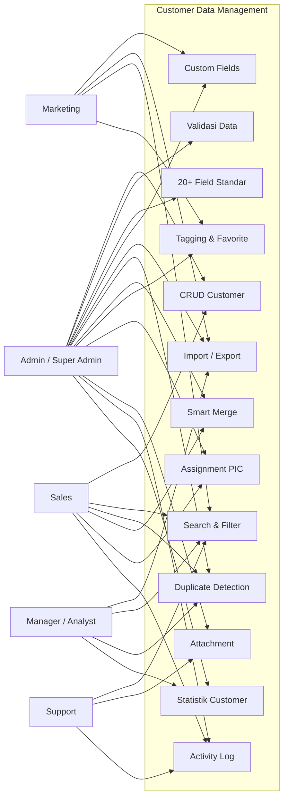
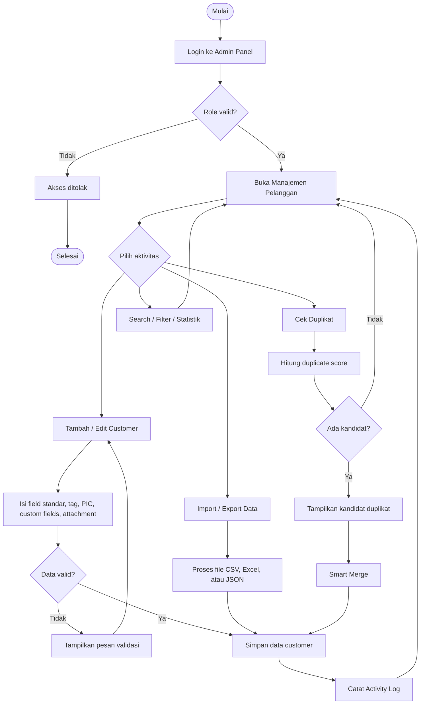
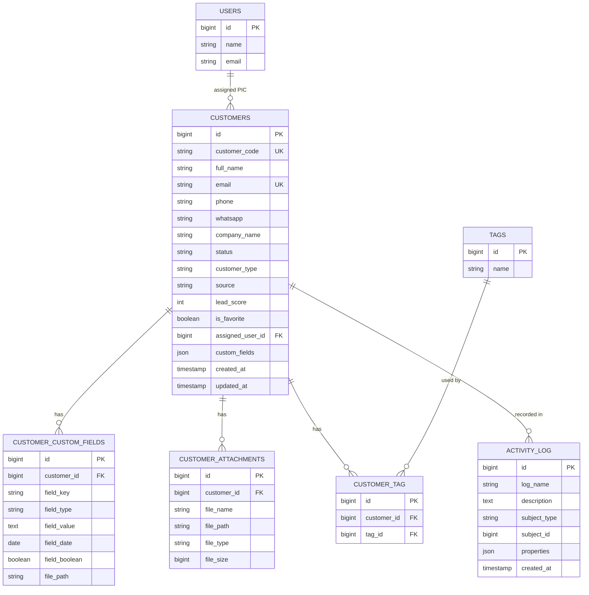
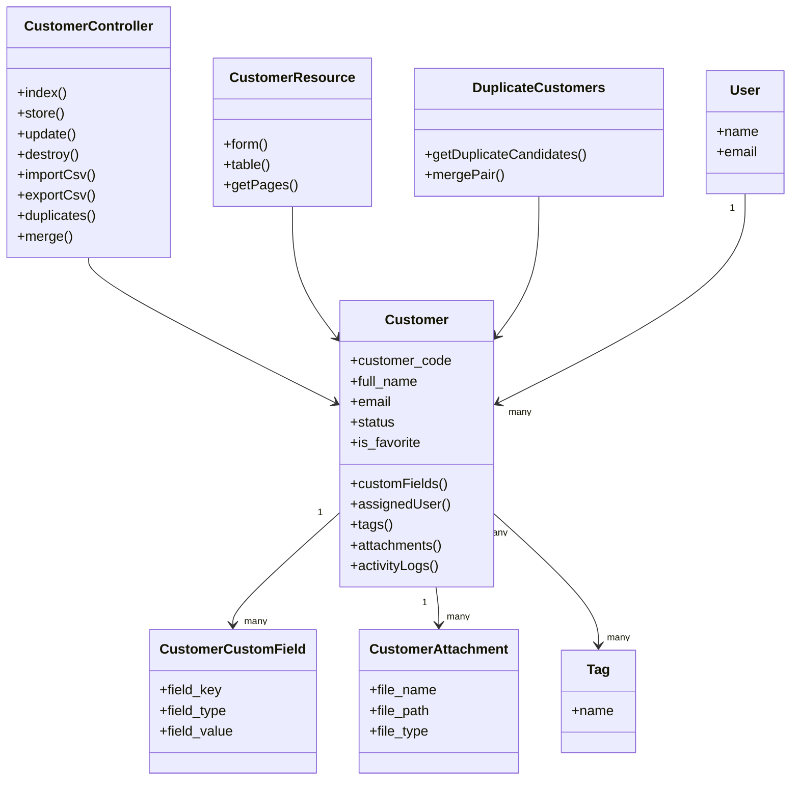

# Laporan Pengerjaan SmartCRM79

## Modul Customer Data Management

Disusun untuk memenuhi tugas proyek terapan mata kuliah.

**Dosen Pengampu:** Tri Brotoharsono  
**Program Studi:** D3 Rekayasa Perangkat Lunak Aplikasi  
**Fakultas:** Fakultas Ilmu Terapan  
**Universitas:** Telkom University  
**Tahun:** 2026

**Disusun Oleh:**

- Maikel Buala Beriman Hulu
- M Indrawan
- Muhammad Rafiq Nur Ghifari

---

# BAB 1 PENDAHULUAN

## 1.1 Latar Belakang

Dalam sistem Customer Relationship Management, data pelanggan merupakan fondasi utama
yang digunakan oleh banyak proses bisnis. Data tersebut dipakai oleh tim sales untuk
follow-up calon pelanggan, tim marketing untuk segmentasi dan campaign, tim support untuk
melihat riwayat pelanggan, serta manajemen untuk membaca kondisi bisnis melalui dashboard
analytics.

Permasalahan yang sering muncul pada sistem CRM adalah data pelanggan tersebar,
berulang, tidak konsisten, sulit dicari, dan tidak memiliki riwayat perubahan yang jelas.
Kondisi tersebut dapat menghambat pengambilan keputusan, memperlambat proses layanan,
dan menyebabkan tim menggunakan informasi pelanggan yang berbeda-beda.

Berdasarkan kebutuhan tersebut, modul **Customer Data Management** pada SmartCRM79
dikembangkan sebagai pusat data pelanggan atau **single source of truth**. Modul ini
bertugas menyimpan, mengelola, mencari, mengelompokkan, mengimpor, mengekspor,
mendeteksi duplikasi, menggabungkan data ganda, menyimpan lampiran, dan mencatat
aktivitas pelanggan secara otomatis.

Project yang dikerjakan menggunakan stack aktual repository, yaitu **Laravel**, **Filament
Admin Panel**, **MySQL/MariaDB**, **Spatie Permission**, **Spatie Activitylog**, **Laravel
Sanctum**, dan **Laravel Excel**. Stack ini dipilih karena sudah menjadi fondasi project
SmartCRM yang sedang dikembangkan bersama kelompok lain.

## 1.2 Rumusan Masalah

Rumusan masalah dalam pengerjaan modul Customer Data Management adalah sebagai berikut:

1. Bagaimana membangun database pelanggan yang dapat menjadi single source of truth untuk seluruh modul SmartCRM?
2. Bagaimana menyediakan fitur CRUD pelanggan lengkap dengan validasi data?
3. Bagaimana mendukung 20+ field standar serta custom fields dinamis?
4. Bagaimana menyediakan fitur import dan export data pelanggan dalam format CSV, Excel, dan JSON?
5. Bagaimana menyediakan fitur pencarian, filter multi-kriteria, dan full-text search?
6. Bagaimana mendeteksi data pelanggan duplikat dan menggabungkannya melalui smart merge?
7. Bagaimana menyediakan fitur tagging, segmentasi, favorite list, assignment PIC, dan attachment pelanggan?
8. Bagaimana mencatat activity log per pelanggan agar perubahan data dapat ditelusuri?
9. Bagaimana membedakan tampilan dan akses fitur berdasarkan role pengguna?

## 1.3 Tujuan Proyek

Tujuan pengerjaan modul Customer Data Management adalah:

1. Membangun pusat data pelanggan yang konsisten, terstruktur, dan mudah diakses.
2. Menyediakan fitur manajemen pelanggan yang lengkap melalui dashboard admin.
3. Menyediakan API pelanggan agar modul lain dapat melakukan integrasi.
4. Meningkatkan kualitas data melalui duplicate detection dan smart merge.
5. Mendukung kebutuhan operasional sales, marketing, support, dan manager.
6. Menyediakan dokumentasi standar berupa requirement, UI/UX specification, API contract, implementation report, dan test notes.
7. Menyiapkan project agar mudah didemokan dan dinilai sesuai scope Customer Data Management.

## 1.4 Batasan Modul

Modul ini berfokus pada pengelolaan data pelanggan. Fitur seperti sales pipeline, campaign
marketing, ticket support, dan analytics detail berada di luar scope utama, tetapi modul
Customer Data Management menyediakan data yang dapat digunakan oleh fitur-fitur tersebut.

---

# BAB 2 ANALISIS SISTEM

## 2.1 Deskripsi Objek Terapan

Objek terapan pada project ini adalah modul **Customer Data Management** di dalam
SmartCRM79. Modul ini menjadi master data pelanggan dan digunakan sebagai referensi utama
oleh modul CRM lainnya.

Fitur utama yang telah dikerjakan meliputi:

- CRUD data pelanggan.
- Validasi kode customer dan email unik.
- 20+ field standar customer.
- Unlimited dynamic custom fields.
- Custom fields bertipe text, dropdown, date, checkbox, dan file.
- Import data CSV/Excel.
- Export data CSV, Excel, dan JSON.
- Advanced search dan filter multi-kriteria.
- Full-text search untuk MySQL/MariaDB.
- Duplicate detection.
- Smart merge.
- Tagging dan segmentasi manual.
- Favorite list.
- Assignment customer ke Sales/Admin.
- Attachment pelanggan.
- Activity log per pelanggan.
- Dashboard statistik customer.
- Role-based access dan role-based UI.

## 2.2 Analisis Pengguna

Pengguna modul terdiri dari beberapa role dengan kebutuhan berbeda:

| Role | Kebutuhan Utama |
| --- | --- |
| Admin / Super Admin | Mengelola seluruh data customer, import/export, merge duplikat, role access, dan validasi data. |
| Sales | Menambah, mengubah, mencari, dan melakukan follow-up customer yang menjadi tanggung jawabnya. |
| Marketing | Melakukan segmentasi pelanggan, tagging, import/export data, dan menyiapkan data campaign. |
| Support | Melihat detail pelanggan, attachment, dan activity log sebagai konteks layanan pelanggan. |
| Manager/Analyst | Melihat statistik, memfilter data, melakukan export, dan meninjau kualitas data. |

## 2.3 Analisis Kebutuhan Fungsional

| Kode | Kebutuhan | Status |
| --- | --- | --- |
| F-01 | CRUD pelanggan | Selesai |
| F-02 | Validasi real-time di dashboard | Selesai |
| F-03 | 20+ field standar pelanggan | Selesai |
| F-04 | Unlimited custom fields | Selesai |
| F-05 | Custom field text/dropdown/date/checkbox/file | Selesai |
| F-06 | Import CSV/Excel dengan template | Selesai |
| F-07 | Export CSV/Excel/JSON | Selesai |
| F-08 | Advanced search/filter | Selesai |
| F-09 | Full-text search MySQL/MariaDB | Selesai |
| F-10 | Duplicate detection | Selesai |
| F-11 | Smart merge | Selesai |
| F-12 | Tagging/segmentation | Selesai |
| F-13 | Favorite list | Selesai |
| F-14 | Assignment PIC Sales/Admin | Selesai |
| F-15 | Attachment dengan preview/download | Selesai |
| F-16 | Activity log per pelanggan | Selesai |
| F-17 | Role-based UI | Selesai |
| F-18 | Dokumentasi standar project | Selesai |

## 2.4 Analisis Kebutuhan Non-Fungsional

| Kategori | Kebutuhan |
| --- | --- |
| Keamanan | Role-based access menggunakan Spatie Permission. |
| Auditability | Perubahan data dicatat menggunakan Spatie Activitylog. |
| Maintainability | Struktur mengikuti pattern Laravel, Filament Resource, model, migration, controller, dan seeder. |
| Interoperability | Data tersedia melalui REST API dan export JSON/CSV/Excel. |
| Usability | Dashboard menggunakan label Bahasa Indonesia dan aksi yang relevan per role. |
| Data Quality | Duplicate detection, smart merge, validasi uniqueness, dan favorite/tagging. |

## 2.5 Teknologi yang Digunakan

| Teknologi | Fungsi |
| --- | --- |
| Laravel | Backend utama dan routing API. |
| Filament | Admin panel, form, table, import/export, widgets. |
| MySQL/MariaDB | Database lokal melalui Laragon. |
| Spatie Permission | Role dan permission. |
| Spatie Activitylog | Audit trail dan activity log. |
| Laravel Sanctum | Autentikasi API. |
| Laravel Excel | Import/export CSV dan Excel. |
| Vite/Tailwind | Build asset frontend. |
| Pest/PHPUnit | Testing backend. |

---

# BAB 3 PERANCANGAN SISTEM

## 3.1 Use Case Diagram

Use case diagram berikut menggambarkan aktor dan fitur utama pada modul Customer Data
Management. Diagram dibuat sederhana agar peran setiap aktor mudah dipahami.



## 3.2 Activity Diagram

Activity diagram berikut menjelaskan alur utama penggunaan modul, mulai dari login,
pengelolaan customer, validasi, penyimpanan data, sampai pencatatan activity log.



## 3.3 Entity Relationship Diagram

ERD berikut menunjukkan struktur data utama pada modul Customer Data Management.
Entitas `CUSTOMERS` menjadi pusat data, sedangkan custom fields, attachments, tags, user,
dan activity log menjadi data pendukung.



## 3.4 Class Diagram

Class diagram berikut menggambarkan hubungan class utama pada implementasi Laravel dan
Filament. Class dibuat ringkas agar fokus pada komponen yang benar-benar digunakan dalam
modul Customer Data Management.



---

# BAB 4 IMPLEMENTASI

## 4.1 Ringkasan Pengerjaan

Pengerjaan dimulai dari memperbaiki error pada `CustomerResource.php`, menyesuaikan namespace
Filament, menyelesaikan konflik file, memperbaiki migrasi, lalu melanjutkan pengembangan fitur
Customer Data Management hingga sesuai requirement.

Tahapan pengerjaan:

1. Memperbaiki error Filament pada `CustomerResource.php`.
2. Memastikan route admin dan API customer dapat berjalan.
3. Membuat role demo agar Admin, Sales, Marketing, Support, dan Manager dapat login.
4. Membedakan tampilan dan aksi berdasarkan role.
5. Menambahkan fitur import dan export customer.
6. Menambahkan duplicate detection dan smart merge.
7. Menambahkan tagging dan segmentasi pelanggan.
8. Menambahkan assignment customer ke PIC Sales/Admin.
9. Menambahkan dashboard statistics widget.
10. Menambahkan 20+ field standar customer.
11. Menambahkan custom fields typed.
12. Menambahkan favorite list.
13. Menambahkan attachment pelanggan.
14. Menambahkan full-text search MySQL/MariaDB.
15. Membuat dokumentasi standar modul.

## 4.2 File Utama yang Dikerjakan

| File | Fungsi |
| --- | --- |
| `app/Filament/Resources/Customers/CustomerResource.php` | Form, tabel, filter, action, custom fields, attachment, favorite, dan role-based UI. |
| `app/Filament/Resources/Customers/Pages/ListCustomers.php` | Header action import/export/duplicate/create. |
| `app/Filament/Resources/Customers/Pages/DuplicateCustomers.php` | Halaman visual duplicate detection dan smart merge. |
| `app/Filament/Resources/Customers/Widgets/CustomerStatsOverview.php` | Widget statistik customer. |
| `app/Http/Controllers/CustomerController.php` | API CRUD, import/export, duplicate, merge, tag, favorite, attachment, activity. |
| `app/Models/Customer.php` | Model utama customer dan relasi. |
| `app/Models/CustomerCustomField.php` | Model dynamic custom fields typed. |
| `app/Models/CustomerAttachment.php` | Model lampiran customer. |
| `app/Filament/Imports/CustomerImporter.php` | Import customer dari dashboard Filament. |
| `app/Filament/Exports/CustomerExporter.php` | Export customer dari dashboard Filament. |
| `app/Imports/CustomerImport.php` | Import customer via API. |
| `database/migrations/2026_06_13_090000_expand_customer_standard_fields.php` | Penambahan 20+ field standar. |
| `database/migrations/2026_06_13_091000_expand_customer_custom_fields.php` | Penambahan tipe custom field. |
| `database/migrations/2026_06_13_092000_add_customer_full_text_index.php` | Full-text index untuk MySQL/MariaDB. |

## 4.3 Endpoint API Utama

| Method | Endpoint | Fungsi |
| --- | --- | --- |
| GET | `/api/v1/customers` | List customer dengan search/filter. |
| POST | `/api/v1/customers` | Membuat customer. |
| GET | `/api/v1/customers/{id}` | Detail customer. |
| PUT/PATCH | `/api/v1/customers/{id}` | Update customer. |
| DELETE | `/api/v1/customers/{id}` | Hapus customer. |
| POST | `/api/v1/customers/import` | Import customer. |
| GET | `/api/v1/customers/export/json` | Export JSON. |
| GET | `/api/v1/customers/export/csv` | Export CSV. |
| GET | `/api/v1/customers/export/excel` | Export Excel. |
| GET | `/api/v1/customers/duplicates` | Deteksi duplikat. |
| POST | `/api/v1/customers/{id}/merge` | Smart merge. |
| POST | `/api/v1/customers/{id}/tags` | Tambah tag. |
| PATCH | `/api/v1/customers/{id}/favorite` | Toggle favorite. |
| GET | `/api/v1/customers/{id}/activities` | Activity log customer. |
| GET/POST | `/api/v1/customers/{id}/attachments` | List/upload attachment. |
| GET | `/api/v1/attachments/{id}/preview` | Preview attachment. |
| GET | `/api/v1/attachments/{id}/download` | Download attachment. |
| DELETE | `/api/v1/attachments/{id}` | Hapus attachment. |

---

# BAB 5 PENGUJIAN

## 5.1 Pengujian Fitur

| Fitur | Hasil |
| --- | --- |
| Login role demo | Berhasil setelah role dan user demo disiapkan. |
| CRUD customer | Berhasil. |
| Validasi kode/email unik | Berhasil. |
| 20+ field standar | Berhasil ditambahkan ke database, model, form, import, export, dan API. |
| Custom fields typed | Berhasil. |
| Import CSV/Excel | Berhasil disediakan melalui Filament dan API. |
| Export CSV/Excel/JSON | Berhasil. |
| Search/filter | Berhasil. |
| Full-text search | Disiapkan untuk MySQL/MariaDB. |
| Duplicate detection | Berhasil. |
| Smart merge | Berhasil. |
| Tagging/segmentation | Berhasil. |
| Favorite list | Berhasil. |
| Assignment PIC | Berhasil. |
| Attachment | Berhasil melalui API dan UI Filament. |
| Activity log | Berhasil menggunakan Spatie Activitylog. |

## 5.2 Pengujian Command

Command yang sudah dijalankan:

```bash
php artisan route:list --path=customers
php artisan test
npm run build
```

Hasil:

- `php artisan route:list --path=customers`: berhasil, terdapat 21 route customer.
- `php artisan test`: berhasil, 10 tests passed.
- `npm run build`: berhasil.

Catatan:

- `php artisan migrate` perlu dijalankan setelah MySQL/Laragon aktif.
- Pada saat validasi terakhir, koneksi MySQL lokal sempat ditolak di `127.0.0.1:3306`, sehingga migrasi belum dapat diterapkan langsung sampai service database dinyalakan.

---

# BAB 6 PENUTUP

## 6.1 Kesimpulan

Modul Customer Data Management pada SmartCRM79 telah dikembangkan menjadi pusat data
pelanggan yang lengkap dan siap digunakan sebagai single source of truth. Modul ini sudah
mencakup CRUD, 20+ field standar, custom fields dinamis, import/export, search/filter,
duplicate detection, smart merge, tagging, favorite list, attachment, assignment PIC,
activity log, API contract, role-based UI, dan dokumentasi pendukung.

Dengan fitur tersebut, modul Customer Data Management dapat mendukung kebutuhan utama
Operational CRM, Analytical CRM, dan Collaborative CRM karena data pelanggan sudah
tersimpan secara terpusat, dapat ditelusuri, mudah difilter, dan dapat diintegrasikan melalui API.

## 6.2 Saran Pengembangan Lanjutan

Beberapa pengembangan lanjutan yang dapat dilakukan:

1. Menambahkan screenshot halaman aplikasi ke laporan final.
2. Menambahkan automated feature test khusus duplicate detection dan smart merge.
3. Membuat visual timeline activity yang lebih interaktif.
4. Menambahkan notifikasi otomatis saat customer belum ditugaskan ke PIC.
5. Menambahkan integrasi langsung dengan modul Sales, Marketing, Support, Dashboard, dan Integration.

---

# Lampiran

## A. Akun Demo

Password seluruh akun demo:

```text
password
```

| Role | Email |
| --- | --- |
| Admin | `admin@smartcrm.com` |
| Sales | `sales@smartcrm.com` |
| Marketing | `marketing@smartcrm.com` |
| Support | `support@smartcrm.com` |
| Manager/Analyst | `manager@smartcrm.com` |

## B. Cara Menjalankan Project

```bash
composer install
npm install
cp .env.example .env
php artisan key:generate
php artisan migrate
php artisan db:seed
npm run build
php artisan serve
```

Admin panel:

```text
http://127.0.0.1:8000/admin/login
```

## C. Template Import

Template import tersedia di:

```text
docs/customer-data-management/customer-import-template.csv
```
